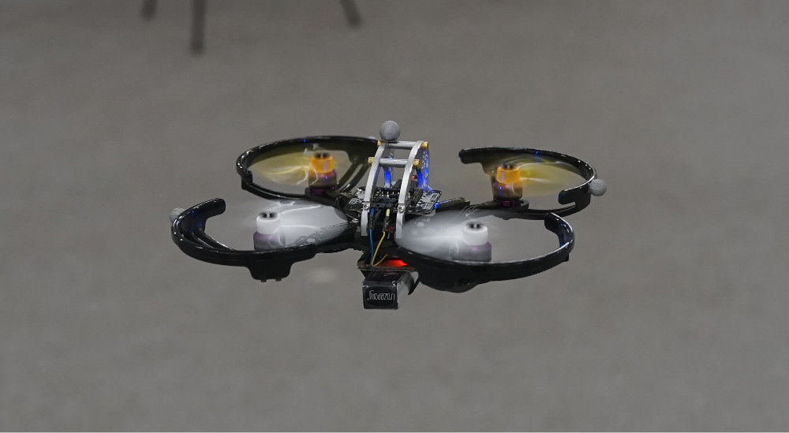
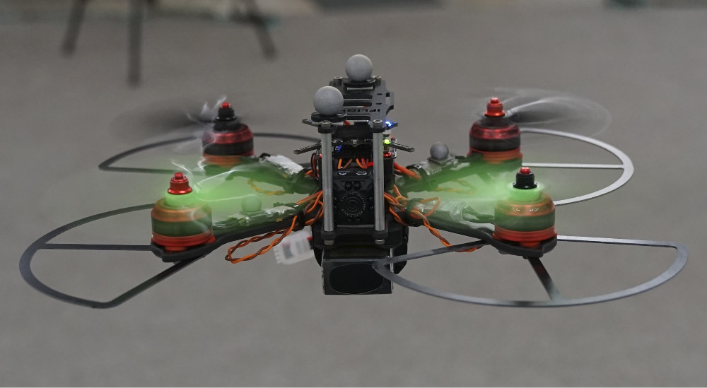

Hardware
========

If you are planning to built a Crazyswarm yourself, below is the list of components we use.

Components
----------

Prices and links as of summer 2017.

.. csv-table:: Part List
   :header: "Name","Price (USD)","Notes","Distributor","Link"

   "Bitcraze Crazyflie 2.0",180,,"Bitcraze/Seeed","https://store.bitcraze.io/collections/kits/products/crazyflie-2-0"
   "Crazyradio PA",30,"1 suffices for 15 Crazyflies. Also available as kit with Crazyflie.","Bitcraze/Seeed","https://store.bitcraze.io/products/crazyradio-pa"
   "LED-ring deck",20,"Optional for light effects","Bitcraze/Seeed","https://store.bitcraze.io/collections/decks/products/led-ring-deck"
   "Propeller pack",5,"Breaks most often; buy ~ 0.5 packs per CF","Bitcraze/Seeed","https://store.bitcraze.io/collections/spare-parts-crazyflie-2-0/products/propeller-pack"
   "Spare motor mounts",5,"Breaks second most often; buy ~0.5 packs per CF","Bitcraze/Seeed","https://store.bitcraze.io/collections/spare-parts-crazyflie-2-0/products/crazyflie-2-0-4-x-spare-7-mm-motor-mounts"
   "Turnigy nano-tech 260mAh 1S",2.45,"Buy 2 or 3 per CF","Hobbyking","https://hobbyking.com/en_us/turnigy-nano-tech-260mah-1s-35-70c-lipo-pack-qr-ladybird-genius-cp-mini-cp.html?___store=en_us"
   "Turnigy Micro-6 Lipoly Battery Charger",13.34,"Buy 1 for 6 Cfs","Hobbyking","https://hobbyking.com/en_us/turnigy-micro-6-lipoly-battery-charger.html?___store=en_us"
   "7.9mm reflective markers",4,"Buy 4 per CF (and a few spares)","B&L Engineering","http://www.bleng.com/7-9mm-reflective-markers-set-of-10.html"
   "Double-sided foam tape (e.g. 3M VHB)",10,"Command Poster Strips work well, too",,
   "Debug adapter",30,"1 suffices for swarm; only needed if firmware development is intended","Bitcraze/Seeed","https://store.bitcraze.io/collections/accessories/products/debug-adapter"
   "J-LINK EDU",60,"1 suffices for swarm; only needed if firmware development is intended","Segger","https://shop-us.segger.com/J_Link_EDU_p/8.08.90.htm"

Medium Quadrotor
----------------

Prices and links as of March 2018.

.. csv-table:: Part List
   :header: "Part","Item","Weight (g)", "Price (USD)","Notes","Distributor","Link"

   "Flight Controller","Bitcraze Crazyflie 2.0",,180,,"Bitcraze/Seeed","https://store.bitcraze.io/collections/kits/products/crazyflie-2-0"
   "Flight Controller","Bitcraze BigQuad Deck",4,7,,"Bitcraze/Seeed","https://store.bitcraze.io/collections/decks/products/bigquad-deck"
   "Frame + Prop Guards","Crazypony KingKong Flyegg 130mm",30,22.99,,"Amazon","https://www.amazon.com/gp/product/B073LBNJCR/ref=oh_aui_detailpage_o06_s02?ie=UTF8&psc=1"
   "Power + ESC combo","DYS F18A 4-in-1 ESC",8,35.99,,"Amazon","https://www.amazon.com/gp/product/B077G26CTX/ref=oh_aui_detailpage_o06_s01?ie=UTF8&psc=1"
   "Motors x4", "Crazypony 1104 7500KV x4",26,52.99,,"Amazon","https://www.amazon.com/gp/product/B06XNJ8XPP/ref=oh_aui_detailpage_o06_s01?ie=UTF8&psc=1"
   "Propellers","Crazypony 2840 3-blade x8",5.5,7.99,,"Amazon","https://www.amazon.com/gp/product/B071FN9V78/ref=oh_aui_detailpage_o06_s00?ie=UTF8&psc=1"
   "Battery","Crazypony 450mAh 2S x2",29,18.99,,"Amazon","https://www.amazon.com/gp/product/B07351J77T/ref=oh_aui_detailpage_o02_s00?ie=UTF8&psc=1"

Large Quadrotor
----------------

Prices and links as of March 2018.

.. csv-table:: Part List
   :header: "Part","Item","Weight (g)", "Price (USD)","Notes","Distributor","Link"

   "Flight Controller","Bitcraze Crazyflie 2.0",,180,,"Bitcraze/Seeed","https://store.bitcraze.io/collections/kits/products/crazyflie-2-0"
   "Flight Controller","Bitcraze BigQuad Deck",4,7,,"Bitcraze/Seeed","https://store.bitcraze.io/collections/decks/products/bigquad-deck"
   "Frame","iFlight RACER iX5 V2 210mm",24.2,36.99,,"Amazon","https://www.amazon.com/gp/product/B06XYRPQCD/ref=oh_aui_detailpage_o05_s01?ie=UTF8&psc=1"
   "Power Distribution","Thriverline Matek PDB & Dual BEC",13,10,,"Amazon","https://www.amazon.com/gp/product/B06XB9K9S8/ref=oh_aui_detailpage_o05_s02?ie=UTF8&psc=1"
   "ESCs x4","Makerfire BLHeli 20A x4",25,34.99,,"Amazon","https://www.amazon.com/Makerfire-BLHeli-Brushless-Controller-QAV250/dp/B07869QR66/ref=sr_1_1"
   "Motors","DLFPV 2205 2300KV x4",115,39.99,,"Amazon","https://www.amazon.com/gp/product/B01JM1C9GK/ref=od_aui_detailpages02?ie=UTF8&psc=1"
   "Propellers","RAYCORP 5040 3-Blade x8",6.2,14.99,,"Amazon","https://www.amazon.com/gp/product/B01N3R7RCI/ref=oh_aui_detailpage_o05_s02?ie=UTF8&psc=1"
   "Battery","Tattu 1800mAh 45C 3",200,19.99,,"Amazon","https://www.amazon.com/gp/product/B013I9SAHO/ref=oh_aui_detailpage_o05_s00?ie=UTF8&psc=1"
   "Propeller Guards","5-inch Prop guard for 250mm Class",18,4.5,"Optional","Hobbyking","https://hobbyking.com/en_us/propeller-guards-for-the-250-class-racer-5inch-set-of-4.html"
   "Alternative Prop Guards","KingKong 5 Inch Propeller Guard",,4.9,"Optional","Helipal","http://www.helipal.com/kingkong-5-inch-propeller-guard-black.html"
   "SD Card Camera","EOVAS 1080P Small Cam",40,25,"Optional","Amazon","https://www.amazon.com/gp/product/B074QM3JDP/ref=oh_aui_detailpage_o04_s00?ie=UTF8&psc=1"
