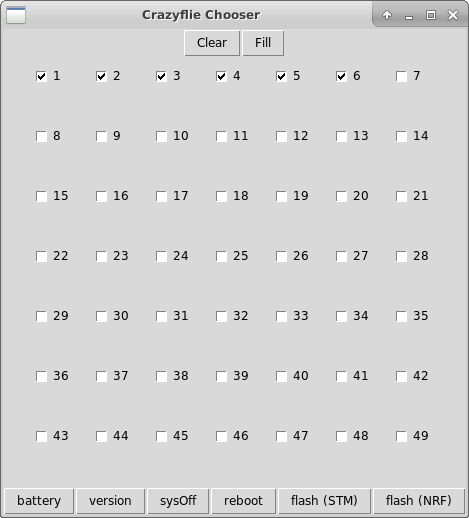

Usage
=====

Crazyflie Preparation
---------------------

Since the Crazyflies are sharing radios and communication channels, they need to have a unique identifier/address.
The convention in the Crazyswarm is to use the following address::

    0xE7E7E7E7<X>

where ``<X>`` is the number of the Crazyflie in the hexadecimal system. For example cf1 will use address ``0xE7E7E7E701`` and cf10 uses address ``0xE7E7E7E70A``.
The easiest way to assign addresses is to use the official Crazyflie Python Client.

#. Label your Crazyflies
#. Assign addresses using the Crazyflie Python Client (use a USB cable for easiest handling)
#. Each radio can control about 15 Crazyflies. If you have more than 15 CFs you will need to assign different channels to the Crazyflies. For example, if you have 49 Crazyflies you'll need three unique channels. It is up to you which channels you assign to which CF, but a good way is to use the Crazyflie number modulo the number of channels. For example, cf1 is assigned to channel 80, cf2 is assigned to channel 90, cf3 is assigned to channel 100, cf4 is assigned to channel 80 and so on.
#. Upgrade the firmwares of your Crazyflies with the provided firmwares (both NRF51 and STM32 firmwares).

  - Option 1: Upload the firmware via the command line using ``make cload`` as described `here <https://wiki.bitcraze.io/doc:crazyflie:dev:starting>`_ instead of using Bitcraze graphical app.
  - Option 2: Upload the precompiled firmware by executing the following steps:

      #. Plug in a battery
      #. Turn your Crazyflie off by pressing the on/off button
      #. Set your Crazyflie into bootloader mode by holding the on/off button for 3 seconds (The blue M2 and M3 LEDs start to blink)
      #. ``rosrun crazyflie_tools flash --target nrf51 --filename prebuilt/cf2_nrf.bin``
      #. Turn your Crazyflie off by pressing the on/off button
      #. Set your Crazyflie into bootloader mode by holding the on/off button for 3 seconds (The blue M2 and M3 LEDs start to blink)
      #. ``rosrun crazyflie_tools flash --target stm32 --filename prebuilt/cf2.bin``

#. Upgrade the firmware of you Crazyradios with the provided firmware.

  - Option 1: follow the instructions in the ``crazyradio-firmware`` folder to install the self-compiled version.
  - Option 2: Use the prebuilt binary:

      #. ``python crazyradio-firmware/usbtools/launchBootloader.py``
      #. ``python crazyradio-firmware/usbtools/nrfbootload.py flash prebuilt/cradio.bin``
      #. Now unplug and re-plug the radio. You can check the version using ``rosrun crazyflie_tools scan``, which should report ``Found Crazyradio with version 99.55``.

Your Crazyflie needs to be rebooted after any change of the channel/address for the changes to take any effect.

Adjust Configuration Files
--------------------------

There are three major configuration files. First, we have a config file listing all available (but not necessarily active) CFs::

    # ros_ws/src/crazyswarm/launch/allCrazyflies.yaml
    crazyflies:
      - id: 1
        channel: 100
        initialPosition: [1.5, 1.5, 0.0]
        type: default
      - id: 2
        channel: 110
        initialPosition: [1.5, 1.0, 0.0]
        type: medium

The file assumes that the address of each CF is set as discussed earlier. The channel can be freely configured. The initial position needs to be known for the frame-by-frame tracking as initial guess. Positions are specified in meters, in the coordinate system of your motion capture device. It is not required that the CFs start exactly at those positions (a few centimeters variation is fine).

The second configuration file defines the possible types::

    # ros_ws/src/crazyswarm/launch/crazyflieTypes.yaml
    crazyflieTypes:
      default:
        bigQuad: False
        batteryVoltageWarning: 3.8  # V
        batteryVoltateCritical: 3.7 # V
        markerConfiguration: 0
        dynamicsConfiguration: 0
        firmwareParams:
          ...
      medium:
        bigQuad: True
        batteryVoltageWarning: 7.6  # V
        batteryVoltateCritical: 7.4 # V
        markerConfiguration: 1
        dynamicsConfiguration: 0
        firmwareParams:
          ...
    numMarkerConfigurations: 2
    markerConfigurations:
      "0":  # for standard Crazyflie
        numPoints: 4
        offset: [0.0, -0.01, -0.04]
        points:
          "0": [0.0177184,0.0139654,0.0557585]
          "1": [-0.0262914,0.0509139,0.0402475]
          "2": [-0.0328889,-0.02757,0.0390601]
          "3": [0.0431307,-0.0331216,0.0388839]
      "1": # medium frame
        numPoints: 4
        offset: [0.0, 0.0, -0.03]
        points:
          "0": [-0.00896228,-0.000716753,0.0716129]
          "1": [-0.0156318,0.0997402,0.0508162]
          "2": [0.0461693,-0.0881012,0.0380672]
          "3": [-0.0789959,-0.0269793,0.0461144]
    numDynamicsConfigurations: 1
    dynamicsConfigurations:
      "0":
        maxXVelocity: 2.0
        maxYVelocity: 2.0
        maxZVelocity: 3.0
        maxPitchRate: 20.0
        maxRollRate: 20.0
        maxYawRate: 10.0
        maxRoll: 1.4
        maxPitch: 1.4
        maxFitnessScore: 0.001

The third configuration file is the ROS launch file (``ros_ws/src/crazyswarm/launch/hover_swarm.launch``). It contains settings on which motion capture system to use and the marker arrangement on the CFs.

Select Motion Capture System
^^^^^^^^^^^^^^^^^^^^^^^^^^^^

Below are the relevant settings for the motion capture system::

    # ros_ws/src/crazyswarm/launch/hover_swarm.launch
    # tracking
    motion_capture_type: "vicon" # one of vicon,optitrack
    object_tracking_type: "libobjecttracker" # one of motionCapture,libobjecttracker
    vicon_host_name: "vicon" # only needed if vicon is selected
    optitrack_local_ip: "localhost" # only needed if optitrack is selected
    optitrack_server_ip: "optitrack" # only needed if optitrack is selected

You can choose the motion capture type (currently ``vicon`` or ``optitrack``). The application will connect the the motion capture system using the appropriate SDKs (DataStream SDK and NatNet, respectively). If you select ``libobjecttracker`` as ``object_tracking_type``, the tracking will just use the raw marker cloud from the motion capture system and track the CFs frame-by-frame. If you select ``motionCapture`` as ``object_tracking_type``, the objects as tracked by the motion capture system will be used. In this case you will need unique marker arrangements and your objects need to be named ``cf1``, ``cf2``, ``cf3``, and so on.

When using ``libobjecttracker`` it is important to disable tracking of Crazyflies in your motion capture system's control software. Some motion capture systems remove markers from the point cloud when they are matched to an object. Since ``libobjecttracker`` operates on the raw point cloud, it will not be able to track any Crazyflies that have already been "taken" by the motion capture system.

Vicon
"""""

Vicon is fully supported and tested with Tracker 3.4.

OptiTrack
"""""""""

.. warning::

    The OptiTrack support currently has the following limitations:
      * It is incompatible with Motive 2.0 because it uses NatNet 3.0.1 which has a different bit-steam syntax. Use an older version (Motive 1.10.3 is known to work).

Use the following settings for correct operation:
  * Un-tick the rigid body in Motive so that the point cloud is streamed.
  * Advanced network settings. Up axis: Z
  * When specifying the marker locations in the config file you need to use the coordinates in Rviz and not Motive.

Instruction on how to use the rigid body option with Optitrack are available `here <https://github.com/USC-ACTLab/libmotioncapture/pull/3>`_.

Configure Marker Arrangement
^^^^^^^^^^^^^^^^^^^^^^^^^^^^

If you select the ``libobjecttracker`` as ``motion_capture_type``, you will need to provide the marker arrangement of your markers. All CFs must use the same marker configuration. An example marker configuration using four markers is shown below:

.. image:: markerConfigurationExample.jpg

#. Place one CF with the desired arrangement at the origin of your motion capture space. The front of the Crazyflie should point in the ``x`` direction of the motion capture coordinate system.
#. Find the coordinates of the used markers, for example by using ``roslaunch crazyswarm mocap_helper.launch``.
#. Update ``crazyflieTypes.yaml``, see the example above.

Monitor Swarm
-------------

A simple GUI is available to enable/disable a subset of the CFs, check the battery voltage, reboot and more.
The tool reads the ``ros_ws/src/crazyswarm/launch/all49.yaml`` file.
You can execute it using::

    ros_ws/src/crazyswarm/scripts
    python chooser.py

An example screenshot is given below:

:Clear:   Disables all CFs
:Fill:    Enables all CFs
:battery: Retrieves battery voltage for enabled CFs. Only works if ``crazyflie_server`` is not running at the same time. Can be used while the CF is in power-safe mode.
:version: Retrieves STM32 firmware version of enabled CFs. Only works if ``crazyflie_server`` is not running at the same time. Can only be used if CF is fully powered on.
:sysOff: Puts enabled CFs in power-safe mode (NRF51 powered, but STM32 turned off). Only works if ``crazyflie_server`` is not running at the same time.
:reboot: Reboot enabled CFs (such that NRF51 and STM32 will be powered). Only works if ``crazyflie_server`` is not running at the same time.
:flash (STM): Flashes STM32 firmware to enabled CFs. Only works if ``crazyflie_server`` is not running at the same time. Assumes that firmware is built.
:flash (NRF): Flashes NRF51 firmware to enabled CFs. Only works if ``crazyflie_server`` is not running at the same time. Assumes that firmware is built.

Basic Flight
------------

In order to fly the CFs, the ``crazyflie_server`` needs to be running. Execute it using::

    source ros_ws/devel/setup.bash
    roslaunch crazyswarm hover_swarm.launch

It should only take a few seconds to connect to the CFs. If you have the LED ring extension installed, you can see the connectivity by the color (green=good connectivity; red=bad connectivity). Furthermore, ``rviz`` will show the estimated pose of all CFs. If there is an error (such as a faulty configuration or a turned-off Crazyflie) an error message will be shown and the application exits. If there is a problem in the communication between the motion capture system and the Crazyswarm server, the application will not exit but the positions of the Crazyflies will not appear in rviz.

If you have an XBox360 joystick attached to your computer. You can issue a take-off command by pressing "Start" and a landing command by pressing "Back". All CFs should take-off/land in a synchronized fashion, holding the x/y position they were originally placed in.

Advanced Flight
---------------

The flight can be controlled by a python script. A few examples are in ``ros_ws/src/crazyswarm/scripts/``.

#. Test the script in simulation first::

    python figure8_csv.py --sim

(If you are asked to press a button, use the right shoulder on your joystick or press enter on the keyboard.)

#. Run the ``crazyflie_server`` (in another terminal window)::

    source ros_ws/devel/setup.bash
    roslaunch crazyswarm hover_swarm.launch

#. Once the connection is successful, execute the script without ``--sim``::

    python figure8_csv.py
