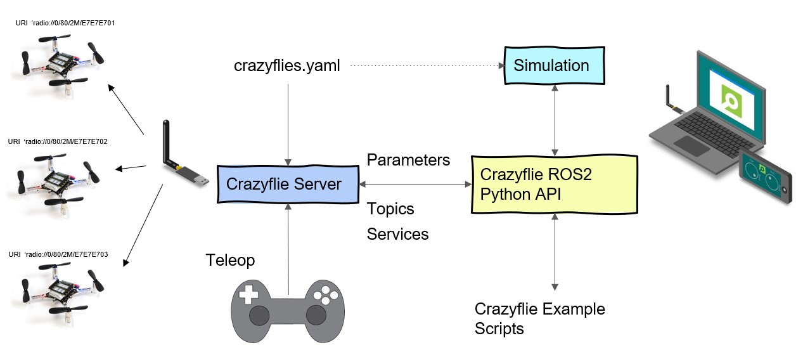

.. _overview:

Overview
========

This page will explain the overview of the crazyflie ROS 2 nodes:

Explanation per node
--------------------

In the `source code of the Crazyswarm2 (Crazyflie ROS 2) project <https://github.com/IMRCLab/crazyswarm2>`_, there are several packages that we will explain here:

- **crazyflie/**: The package that contains the crazyflie server nodes and the crazyflies.yaml.
- **crazyflie_py/**: The package that contains the python library that wraps around the ROS 2 services and topics that connects with the crazyflie server nodes.
- **crazyflie_examples/**:  The package that contains examples of using the crazyflie ROS 2 package. See :ref:`tutorials`.
- **crazyflie_interfaces/**: The package that contain all msgs and srvs for the crazyflie ROS 2 project.

Crazyflie server
----------------

The crazyflie server node connects multiple `Crazyflies <https://www.bitcraze.io/products/crazyflie-2-1/>`_ with on or more `Crazyradio PA dongles <https://www.bitcraze.io/products/crazyradio-pa/>`_.

It has two backends that you can choose from:

- **cpp**: This is based on the `crazyflie-link-cpp <https://github.com/bitcraze/crazyflie-link-cpp>`_ on the lowest layer.
- **cflib**: This is based on the `crazyflie-lib-python <https://www.bitcraze.io/documentation/repository/crazyflie-lib-python/master/>`_ up until the logging, parameter, and command sending handling.

It handles several low level communication aspects with the Crazyflies:

- **Parameter to ROS 2 parameters handling**: It receives the parameter ToC from the Crazyflie, transforms it into ROS 2 parameters, and sets the CF2 parameters based on the *crazyflies.yaml* input.
- **Logging to ROS 2 topics handling**: The server sets up logblocks for data streaming in the crazyflie, and transforms the received variables into ROS 2 topics.
- **Run-time configuration**: Both parameters and logging can be configured in run-time while the server is connected with the Crazyflies. Please check :ref:`usage`.

It also setups several flight command services:

- **Takeoff / Land / GoTo**: With a single service command and a given height or coordinate, you can make the connected crazyflies take off, go to a position and land.
- **Upload / Start trajectory**: You can upload a predefined trajectory and indicate if the Crazyflies need to start flying it.
- **Emergency** : To turn off the motors in case something goes wrong.
- **/all or /cf2** : The services are setup either for all crazyflies to respond to, or each individual crazyflie, depended on the prefix. 

Simulation
----------

The simulator uses the Crazyflie firmware as a software-in-the-loop (SIL). It provides the same ROS interface as the server and therefore can be used with C++ or Python user code.

Currently, the desired setpoint is visualized in rviz (see :ref:`usage`). However, the code is prepared to support physics-based simulation in the future as well.

Support functionality with backends
-----------------------------------

+---------------------+---------+-----------+---------+
| **Functionality**   | **Cpp** | **CFlib** | **Sim** |
+=====================+=========+===========+=========+
| Parameters          | Yes     | Yes       | No      |
+---------------------+---------+-----------+---------+
| Logging                                             |
+---------------------+---------+-----------+---------+
| - default: pose     | Yes     | Yes       | No      |
+---------------------+---------+-----------+---------+
| - default: scan     | Yes     | Yes       | No      |
+---------------------+---------+-----------+---------+
| - default: odom     | No      | Yes       | No      |
+---------------------+---------+-----------+---------+
| - custom            | Yes     | Yes       | No      |
+---------------------+---------+-----------+---------+
| - Add/Remove Srv    | No      | Yes       | No      |
+---------------------+---------+-----------+---------+
| Broadcasts          | Yes     | No        | n/a     |
+---------------------+---------+-----------+---------+
| Manual control                                      |
+---------------------+---------+-----------+---------+
| - cmd_full_state    | Yes     | No        | Yes     |
+---------------------+---------+-----------+---------+
| - cmd_position      | Yes     | No        | No      |
+---------------------+---------+-----------+---------+
| - cmd_hover         | No      | Yes       | No      |
+---------------------+---------+-----------+---------+
| High-level control                                  |
+---------------------+---------+-----------+---------+
| - takeoff/land      | Yes     | Yes       | Yes     |
+---------------------+---------+-----------+---------+
| - go_to             | Yes     | Yes       | Yes     |
+---------------------+---------+-----------+---------+
| - upload/start traj | Yes     | No        | Yes     |
+---------------------+---------+-----------+---------+
| Positioning System                                  |
+---------------------+---------+-----------+---------+
| - Motion Capture    | Yes     | Yes       | No      |
+---------------------+---------+-----------+---------+
| - Flow Deck         | Yes     | Yes       | No      |
+---------------------+---------+-----------+---------+
| - LightHouse        | Yes     | Yes       | No      |
+---------------------+---------+-----------+---------+
| - LPS               | Yes     | Yes       | No      |
+---------------------+---------+-----------+---------+
