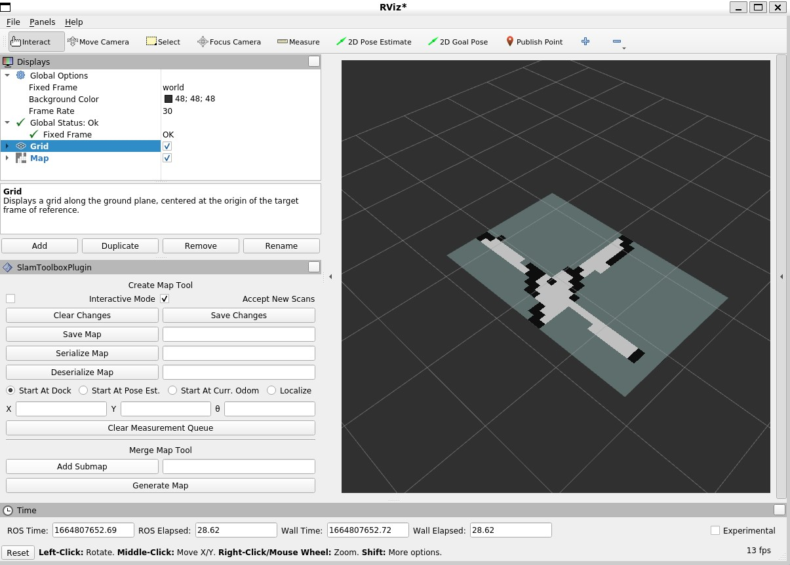

.. _tutorials:

ROS 2 Tutorials
===============

This page shows tutorials which connects the Crazyflie through Crazyswarm2 to with external packages like RVIZ2, teleop_twist_keyboard, SLAM toolbox and NAV2 bringup. Have fun!

.. warning::
  These tutorials are for advanced use and still under development. Beware of errors and bugs and be sure to use https://github.com/IMRCLab/crazyswarm2/discussions for any support questions. Also this requires a bit of knowledge for ROS 2 so we highly recommend following `their beginner tutorials <https://docs.ros.org/en/humble/Tutorials/Beginner-CLI-Tools.html>`_.

Teleoperation keyboard
----------------------

We have an example of the telop_twist_keyboard package working together with the crazyflie

First, make sure that the crazyflies.yaml has the right URI and if you are using the `Flow deck <https://www.bitcraze.io/products/flow-deck-v2/>`_ or `any other position system available <https://www.bitcraze.io/documentation/system/positioning//>`_ to the crazyflie.  
set the controller to 1 (PID). 

And if you  have not already, install the teleop package for the keyboard. (replace DISTRO with humble or iron):

.. code-block:: bash

    sudo apt-get install ros-DISTRO-teleop-twist-keyboard

Then, first checkout keyboard_velmux_launch.py and make sure that the 'robot_prefix' of vel_mux matches your crazyflie ID in crazyfies.yaml ('cf231').

Then run the following launch file to start up the crazyflie server (CFlib):

.. code-block:: bash

    ros2 launch crazyflie_examples keyboard_velmux_launch.py

in another terminal run:

.. code-block:: bash

    ros2 run teleop_twist_keyboard telop_twist_keyboard

Use 't' to take off, and 'b' to land. For the rest, use the instructions of the telop package. 

Vizualization with RVIZ2
------------------------

Make sure your crazyflie knows its position, either by a  `flow deck <https://www.bitcraze.io/products/flow-deck-v2/>`_ or `any other position system available <https://www.bitcraze.io/documentation/system/positioning//>`_ to the crazyflie. 

In crazyflie.yaml, make sure that this following is added or uncommented

.. code-block:: bash
    
    all:
    ...
    firmware_logging:
        enabled: true
        default_topics:
        pose:
            frequency: 10 # Hz

In the first terminal, launch the server (use `backend:=cflib` if you need the odom topic)

.. code-block:: bash

    ros2 launch crazyflie launch.py

In the second terminal

.. code-block:: bash

    rviz2

Then set 'fixed frame' to 'world' and add the TF plugin. Then in 'TF', check the 'show names' checkbox.
The crazyflie names should appear with their estimated position.

This RVIZ2 visualization can be done for the default topics:

* 'pose': '/cf1/pose/' Transforms and Pose 
* 'odom': '/cf1/odom/' Odometry
* 'scan': '/cf1/scan' Scan

Here you can see an example of 5 crazyflies with the Pose default topic enabled, while taking off and landing

.. raw:: html

    

        <iframe src="https://www.youtube.com/embed/w99hLldcSp4" frameborder="0" allowfullscreen style="position: absolute; top: 0; left: 0; width: 100%; height: 100%;"></iframe>
    

Mapping with simple mapper
--------------------------

If you have a crazyflie with a multiranger and flowdeck, you can try out some simple mapping.

Make sure that the scan and odometry logging is enabled in crazyflies.yaml:

.. code-block:: bash

  firmware_logging:
    enabled: true
    default_topics:
      odom:
        frequency: 10 # Hz
      scan:
        frequency: 10 # Hz

and make sure that the pid controller and kalman filter is enabled:

.. code-block:: bash

  firmware_params:
    stabilizer:
      estimator: 2 # 1: complementary, 2: kalman
      controller: 1 # 1: PID, 2: mellinger

If you are using a different name for your crazyflie, make sure to change the following in the example launch file (multiranger_simple_mapper_launch.py):

.. code-block:: bash

    crazyflie_name = '/cf231'

Then start the simple mapper example launch file:

.. code-block:: bash

    ros2 launch crazyflie_examples multiranger_simple_mapper_launch.py

And watch the mapping happening in rviz2 while controlling the crazyflie with the teleop node (see the sections above).

Mapping with the SLAM toolbox
-----------------------------

You can connect the Crazyflie through ROS 2 with existing packages like the `SLAM toolbox <https://github.com/SteveMacenski/slam_toolbox/>`_. 
With a `Flow deck <https://www.bitcraze.io/products/flow-deck-v2/>`_ and `Multi-ranger <https://www.bitcraze.io/products/multi-ranger-deck/>`_
) a simple map can be created.

.. note::
  Mind that this will only show the mapping part of SLAM, as the ray matching with the sparse sensing Multi-ranger is quite challenging for the SLAM toolbox

Preperation
~~~~~~~~~~~

Assuming you have installed ROS 2 and Crazyswarm2 according to the instructions and went through the guides on Usage, now install the slam toolbox:

.. code-block:: bash

    sudo apt-get install ros-DISTRO-slam-toolbox

Go to crazyflie/config/crazyflie.yaml, change the URI of the crazyflie to the one yours has and put the crazyflies you don't use on 'enabled: false':

.. code-block:: bash

  cf1:
    enabled: true
    uri: radio://0/20/2M/E7E7E7E701

And enable the following default topic logging:

.. code-block:: bash

  firmware_logging:
    enabled: true
    default_topics:
      odom:
        frequency: 10 # Hz
      scan:
        frequency: 10 # Hz

Also, make sure that the standard controller is set to 1 (PID) for the flowdeck and the state estimator is set to 2 (kalman):

.. code-block:: bash

  firmware_params:
    stabilizer:
      estimator: 2 # 1: complementary, 2: kalman
      controller: 1 # 1: PID, 2: mellinger

Connecting with the Crazyflie
~~~~~~~~~~~~~~~~~~~~~~~~~~~~~

Let's first look at the launch file real quick (multiranger_mapping_launch.py):

.. code-block:: bash

    return LaunchDescription([
        Node(
            package='crazyflie',
            executable='crazyflie_server.py',
            name='crazyflie_server',
            output='screen',
            parameters=[server_params],
        ),
        Node(
            package='crazyflie',
            executable='vel_mux.py',
            name='vel_mux',
            output='screen',
            parameters=[{"hover_height": 0.3},
                        {"incoming_twist_topic": "/cmd_vel"},
                        {"robot_prefix": "/cf1"}]
        ),
        Node(
        parameters=[
          {'odom_frame': 'odom'},
          {'map_frame': 'world'},
          {'base_frame': 'cf1'},
          {'scan_topic': '/cf1/scan'},
          {'use_scan_matching': False},
          {'max_laser_range': 3.5},
          {'resolution': 0.1},
          {'minimum_travel_distance': 0.01},
          {'minimum_travel_heading': 0.001},
          {'map_update_interval': 0.1}
        ],
        package='slam_toolbox',
        executable='async_slam_toolbox_node',
        name='slam_toolbox',
        output='screen'),
    ])

Here is an explanation of the nodes:

* The first node enables the crazyflie server, namely the python version (cflib) as that currently has logging enabled. This takes the crazyflies.yaml file you just edited and uses those values to set up the crazyflie.
* The second node is a velocity command handler, which takes an incoming twist message, makes the Crazyflie take off to a fixed height and enables velocity control of external packages (you'll see why soon enough).
* The third node is the slam toolbox node. You noted that we gave it some different parameters, where we upped the speed of the map generation, decreased the resolution and turn of ray matching as mentioned in the warning above.

Turn on your crazyflie and put it in the middle of the room you would like to map. Make sure to mark the starting position for later.

Now startup the crazyflie server with the following example launch file, after sourcing the 'setup.bash' of course:

.. code-block:: bash

    source install/setup.bash
    ros2 launch crazyflie_examples multiranger_mapping_launch.py 

You should now see the M4 LED blinking green and red and the following appear on the screen:

.. code-block:: bash

    [INFO] [launch]: All log files can be found below /home/knmcguire/.ros/log/2022-10-03-16-15-53-553693-kim-legion-15498
    [INFO] [launch]: Default logging verbosity is set to INFO
    [INFO] [crazyflie_server.py-1]: process started with pid [15500]
    [INFO] [vel_mux.py-2]: process started with pid [15502]
    [INFO] [async_slam_toolbox_node-3]: process started with pid [15504]
    [async_slam_toolbox_node-3] [INFO] [1664806553.866149124] [slam_toolbox]: Using solver plugin solver_plugins::CeresSolver
    [vel_mux.py-2] [INFO] [1664806559.174521891] [vel_mux]: Velocity Multiplexer set for /cf1 with height 0.3 m using the /cmd_vel topic
    [crazyflie_server.py-1] [INFO] [1664806560.043101845] [crazyflie_server]:  radio://0/20/2M/E7E7E7E701 is fully connected!
    [crazyflie_server.py-1] [INFO] [1664806560.044138096] [crazyflie_server]: All Crazyflies are fully connected!
    [crazyflie_server.py-1] [INFO] [1664806560.054259470] [crazyflie_server]:  radio://0/20/2M/E7E7E7E701: commander.enHighLevel is set to 1
    [crazyflie_server.py-1] [INFO] [1664806560.105691178] [crazyflie_server]:  radio://0/20/2M/E7E7E7E701: stabilizer.controller is set to 1
    [crazyflie_server.py-1] [INFO] [1664806560.107138259] [crazyflie_server]:  radio://0/20/2M/E7E7E7E701: stabilizer.estimator is set to 2
    [crazyflie_server.py-1] [INFO] [1664806560.114968490] [crazyflie_server]: All Crazyflies parameters are initialized
    [crazyflie_server.py-1] [INFO] [1664806560.116479518] [crazyflie_server]: radio://0/20/2M/E7E7E7E701 setup logging for scan at freq 10
    [crazyflie_server.py-1] [INFO] [1664806560.118522365] [crazyflie_server]: radio://0/20/2M/E7E7E7E701 setup logging for odom at freq 10
    [crazyflie_server.py-1] [INFO] [1664806560.123137907] [crazyflie_server]: All Crazyflies loggging are initialized
    [async_slam_toolbox_node-3] [INFO] [1664806560.329904109] [slam_toolbox]: Message Filter dropping message: frame 'cf1' at time 1664806560.232 for reason 'discarding message because the queue is full'
    [async_slam_toolbox_node-3] Info: clipped range threshold to be within minimum and maximum range!
    [async_slam_toolbox_node-3] [WARN] [1664806560.333439709] [slam_toolbox]: maximum laser range setting (3.5 m) exceeds the capabilities of the used Lidar (3.5 m)
    [async_slam_toolbox_node-3] Registering sensor: [Custom Described Lidar]

If anything is off, check if the crazyflie.yaml has been configured correctly!

Now, open up a  rviv2 window in a seperate terminal with :

.. code-block:: bash

    source /opt/ros/DISTRO/setup.bash
    rviz2

Add the following displays and panels to RVIZ:

* Changed the 'Fixed frame' to 'world
* 'Add' button under displays and 'by topic' tab, select the '/map' topic.
* 'Add' button under displays and 'by display type' add a transform.
* 'Panels' on the top menu, select 'add new panel' and select the SLAMToolBoxPlugin

It should look like something like this:

Flying and mapping
~~~~~~~~~~~~~~~~~~

While still connected to the crazyflie with the server, open another terminal and type:

.. code-block:: bash

    source /opt/ros/DISTRO/setup.bash
    ros2 run teleop_twist_keyboard teleop_twist_keyboard

and make the crazyflie take off with the 't' key on your keyboard. Now fly around the room to make a map of it.

.. raw:: html

    

        <iframe src="https://www.youtube.com/embed/-NfKnlJMAHQ" frameborder="0" allowfullscreen style="position: absolute; top: 0; left: 0; width: 100%; height: 100%;"></iframe>
    

.. note::

    Tip: start with turning slowly with yaw, which should be enough to get most of the room. 

Once you are happy, you can save the map with 'Save Map' in the SLAM toolbox panel, and land the crazyflie with 't' with teleop_twist_keyboard. 

If not, you could tweak with the parameters of  the `SLAM toolbox <https://github.com/SteveMacenski/slam_toolbox/>`_ to get a better result.

Connecting with Nav2 Bringup
----------------------------

With the previous tutorial you made a map of the environment, so now it is time to use it for navigation!

Preperation
~~~~~~~~~~~
.. note::

  This tutorial assume you have taken the above mapping tutorial first. 

Find the all the files that were created by the RVIZ2 slam toolbox plugin, which should be in format \*.yaml, \*.posegraph, \*.data and \*.pgm, and copy them in the /crazyflie_examples/data/ folder. 
Either you can replace those that are there already ('map.\*'), or call them different and just change the name in the launch file, which will be explain now.

Next, install the Navigation2 Bringup package:

.. code-block:: bash

  sudo apt-get install ros-DISTRO-nav2-bringup

Looking at the Launch file
~~~~~~~~~~~~~~~~~~~~~~~~~~

Let's take a look at the launch file (multiranger_nav3_launch.py):

.. code-block:: python

    return LaunchDescription([
        Node(
            package='crazyflie',
            executable='crazyflie_server.py',
            name='crazyflie_server',
            output='screen',
            parameters=[{"world_tf_name": 'map'},
                        server_params],
        ),
        Node(
            package='crazyflie',
            executable='vel_mux.py',
            name='vel_mux',
            output='screen',
            parameters=[{"hover_height": 0.3},
                        {"incoming_twist_topic": "/cmd_vel"},
                        {"robot_prefix": "/cf1"}]
        ),
        Node(
        parameters=[
          {'odom_frame': 'odom'},
          {'map_frame': 'map'},
          {'base_frame': 'cf1'},
          {'scan_topic': '/cf1/scan'},
          {'use_scan_matching': False},
          {'max_laser_range': 3.5},
          {'resolution': 0.1},
          {'minimum_travel_distance': 0.01},
          {'minimum_travel_heading': 0.001},
          {'map_update_interval': 0.1},
          {'mode': 'localization'},
          {"map_file_name": cf_examples_dir + "/data/" + map_name},
          {"map_start_pose": [0.0, 0.0, 0.0]} ],
        package='slam_toolbox',
        executable='async_slam_toolbox_node',
        name='slam_toolbox',
        output='screen'),
        IncludeLaunchDescription(
            PythonLaunchDescriptionSource(
                os.path.join(bringup_launch_dir, 'bringup_launch.py')),
            launch_arguments={'slam': 'False',
                            'use_sim_time': 'false',
                            'map': cf_examples_dir + "/data/" + map_name + ".yaml",
                            'params_file': os.path.join(cf_examples_dir, 'nav2_params.yaml'),
                            'autostart': 'true',
                            'use_composition': 'true',
                            'transform_publish_period': '0.02'
                            }.items()
        ),
        IncludeLaunchDescription(
            PythonLaunchDescriptionSource(
                os.path.join(bringup_launch_dir, 'rviz_launch.py')),
            launch_arguments={
                            'rviz_config': os.path.join(bringup_dir, 'rviz', 'nav2_default_view.rviz')}.items())
    ])

The crazyflie_server, vel_mux and slam toolbox nodes are obviously the same as the mapping launch file example, with some key differences:

* crazyflie_server: An extra parameter called 'world_tf_name' which changes the name of the 'world' transform to 'map'. This is to ensure compatibilty with the NAV2 bringup node later.
* slam toolbox:  'map_frame' set to 'map, 'mode' set to localization with a 'map_file_name' and 'map_start_pose' (now remember marking the start position of the mapping tutorial?)

The next two nodes are new, which are included IncludeLaunchDescription to include other launch files (since these are pretty big).

* Navigation Bringup: 'slam' is set to false since that is already enabled, 'map' includes the yaml file of what was created in the previous mapping tutorial. 'params_file' contains all the parameters that have been altered a bit for the crazyflie.
* RVIZ2: 'rviz_config' is set to a default rviz2 file of Nav2 that saves us the trouble of setting everything up by hand. 

Navigate the Crazyflie
~~~~~~~~~~~~~~~~~~~~~~

In a terminal run the following from the ROS 2 workspace. 

.. code-block:: bash

    source install/setup.bash
    ros2 launch crazyflie_examples multiranger_nav2_launch.py 

We will not now show all the print-outs, just make sure that at the crazyflie is connected and it outputs the right transforms and topics like in the mapping tutorial

Now, open another terminal and open up a teleop_twist_keyboard just like last time. Press 't' on your keyboard to make the crazyflie fly.

On top of the RVIZ2 window, you see the button 'Nav2 goal'. Click at in a free spot in the map and watch the crazyflie go places :). 

Also try it out by putting obstacles along the path of the crazyflie like in the video here.

.. raw:: html

    

        <iframe src="https://www.youtube.com/embed/1BKLPkQ6Gz8" frameborder="0" allowfullscreen style="position: absolute; top: 0; left: 0; width: 100%; height: 100%;"></iframe>
    

As you noticed, the movement around the obstacles are pretty conservative. You can tune the values in /config/nav2_params.yaml, like the global or local planner's inflation_layer or the size of the robot.
Please check out  `NAV2's tuning documentation <https://navigation.ros.org/tuning/index.html/>`_ for more explanation of these values.

.. note::
  Final note. The SLAM performance and navigation performance of the Crazyflie with the multiranger is doable but not perfect. We absolutely encourage you to tweak and tune the parameters to get something better! (And if you do, please share :D)

